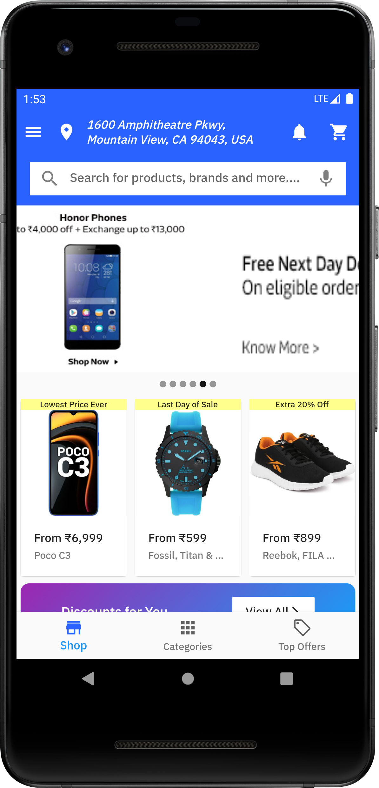
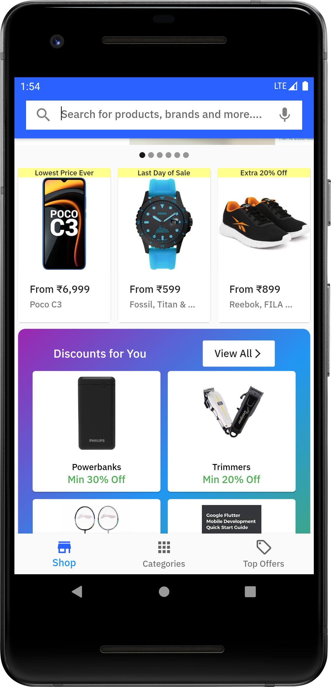
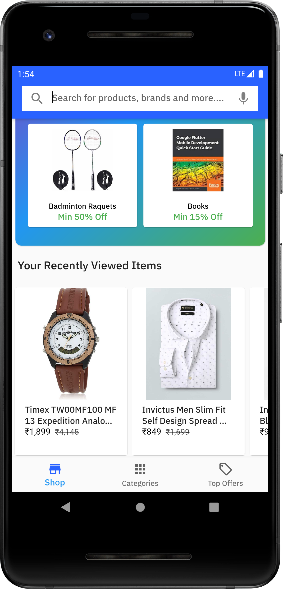
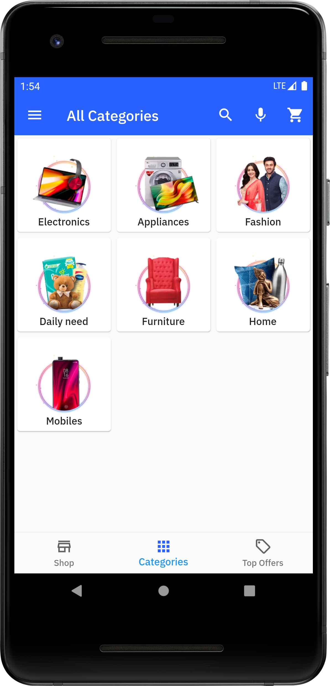
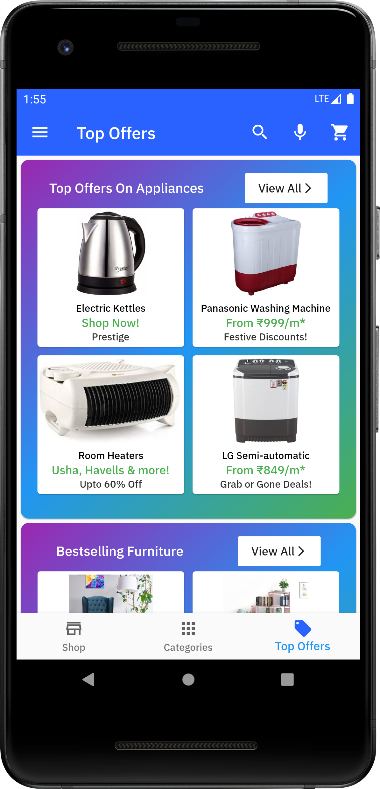
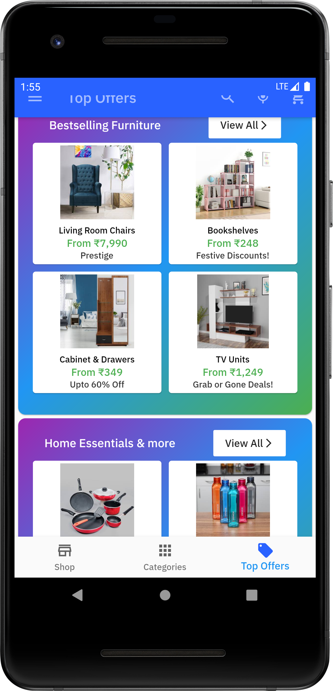
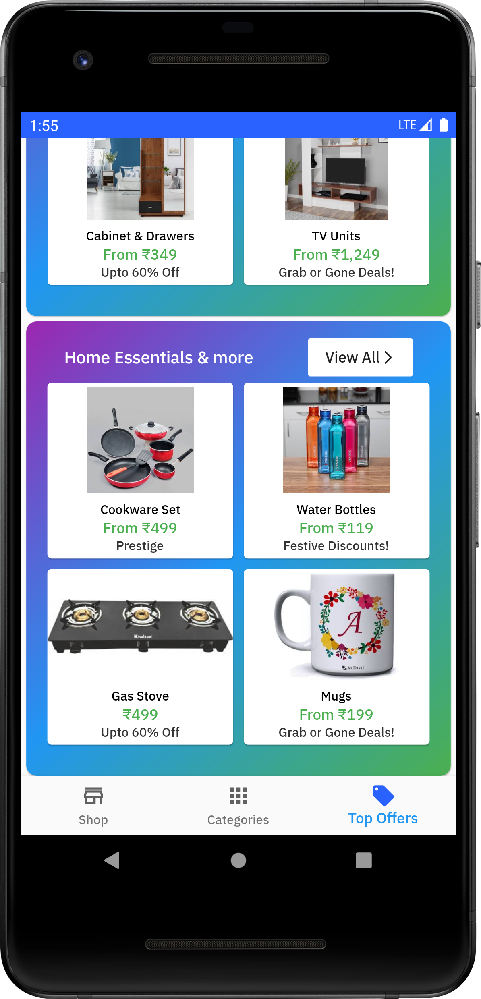
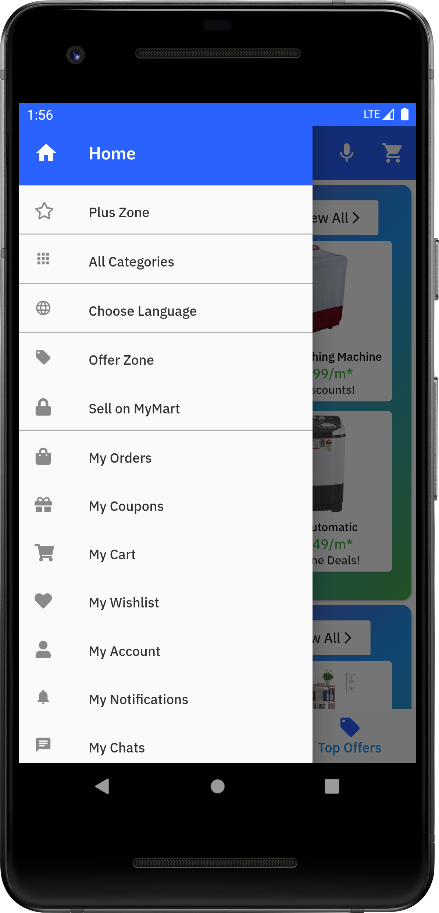
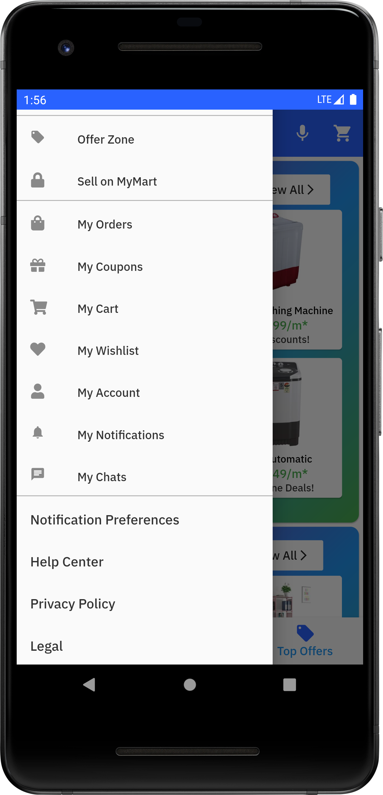

# Ecommerce App UI
 Hi, I have created the front page of an ecommerce app in Flutter. It asks for location permission upon launching the application and according to that shows the latest location of the user. It is a single page app.
# Steps to run the app
 Just like any other flutter project, this project can also be run. No special instruction is required.
Following are some demo photos of this app. These photos can be downloaded from the repository also:

